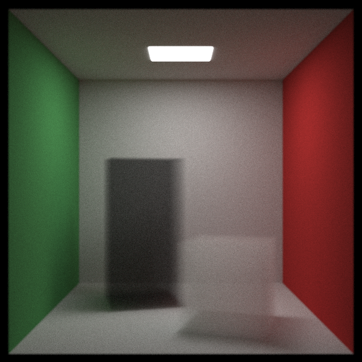
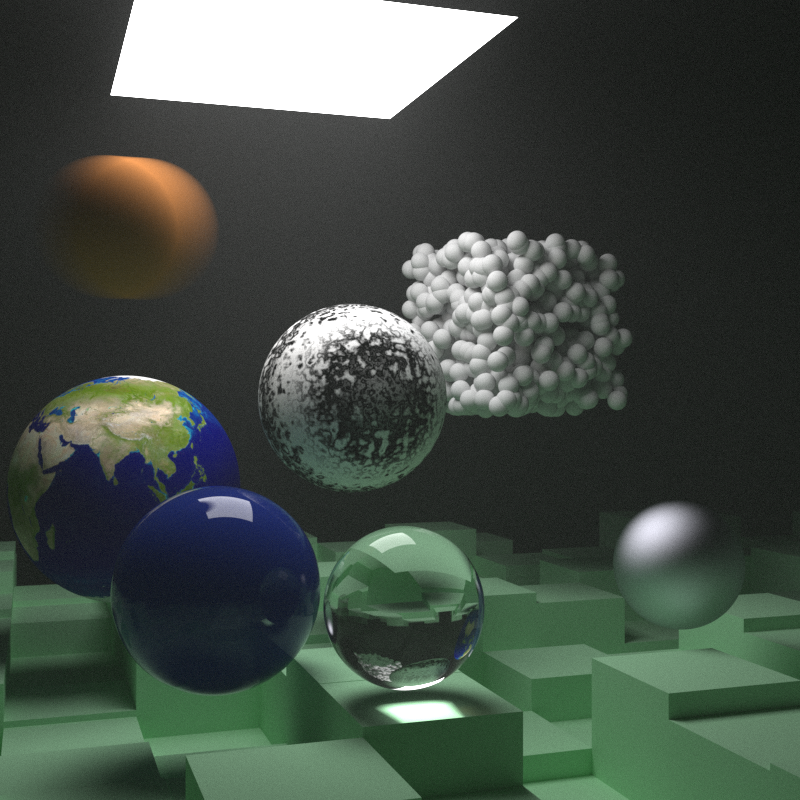
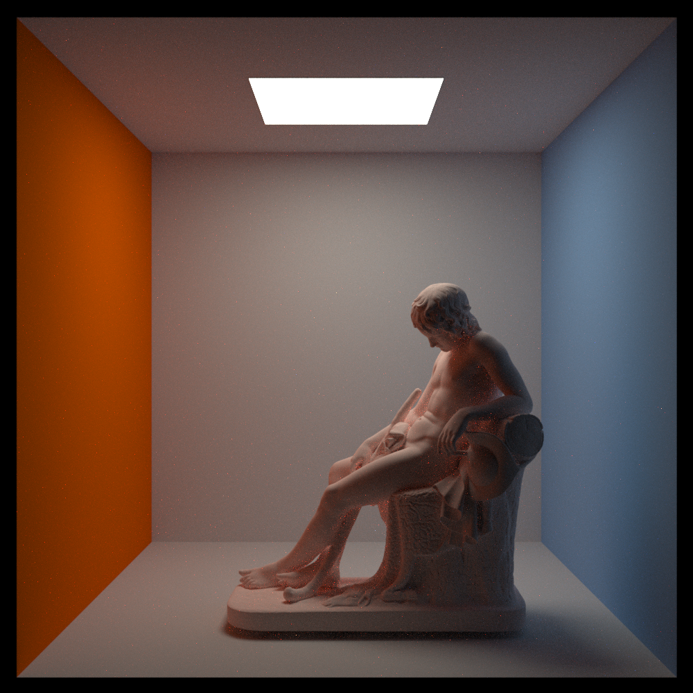
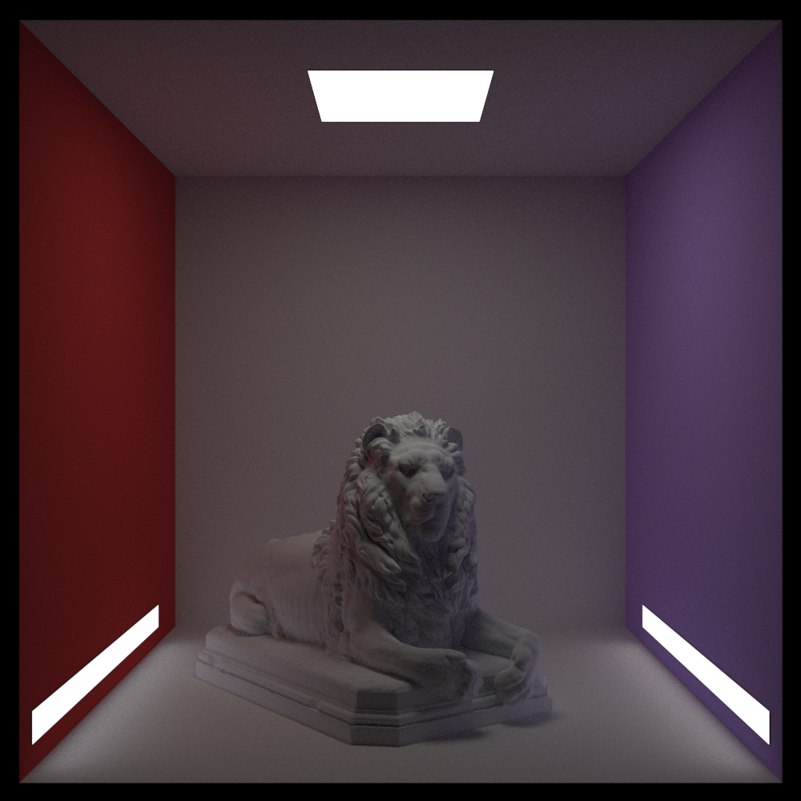

# RayTracingInRust
Follow https://raytracing.github.io/books/RayTracingInOneWeekend.html Ray Tracing Tutorial  
Implemented by Rust.  
Type"cargo run --release >image.ppm" to generate picture

  
  
  
  
  
.png)  
  
